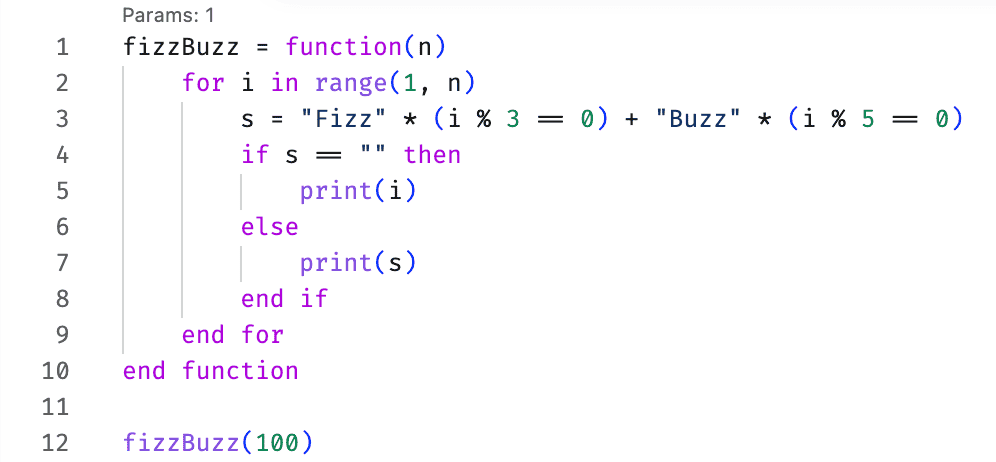

# ITMOScript Support

> [Русская версия](README_RU.md)

[](https://code.visualstudio.com/)
[](LICENSE)

VSCode extension for [ITMOScript](https://github.com/notakeith/itmoscript) — syntax highlighting, hover docs, completions, signature help, outline, and one-click run.

## Features

- **Syntax highlighting** — keywords, constants (`true`, `false`, `nil`), builtins, strings, numbers, comments
- **Hover docs** — descriptions for keywords and built-in functions on hover
- **Completions** — keyword suggestions via IntelliSense
- **Signature help** — parameter hints for built-in and user-defined functions when typing `(` or `,`
- **Outline** — all user-defined functions listed in the Explorer sidebar
- **Run** — ▶ button in the editor title bar runs the current `.is` file via your local interpreter

## Screenshots



## Installation

The extension is distributed as a VSIX package. Download the latest release from [Releases](https://github.com/notakeith/itmoscript-syntax/releases/) and install manually:

1. Open VSCode
2. Go to **Extensions** → **⋯** → **Install from VSIX…**
3. Select the downloaded `itmoscript-syntax-*.vsix`

## Configuration

Set the path to your ITMOScript interpreter in `settings.json`:

```jsonc
"itmoscript.interpreterPath": "/path/to/itmoscript"
```

The extension watches this setting and notifies you when it changes.

## Build

```bash
git clone https://github.com/notakeith/itmoscript-syntax.git
cd itmoscript-syntax
npm install
npm run compile
```

To launch the extension host: open in VSCode and press **F5**.
